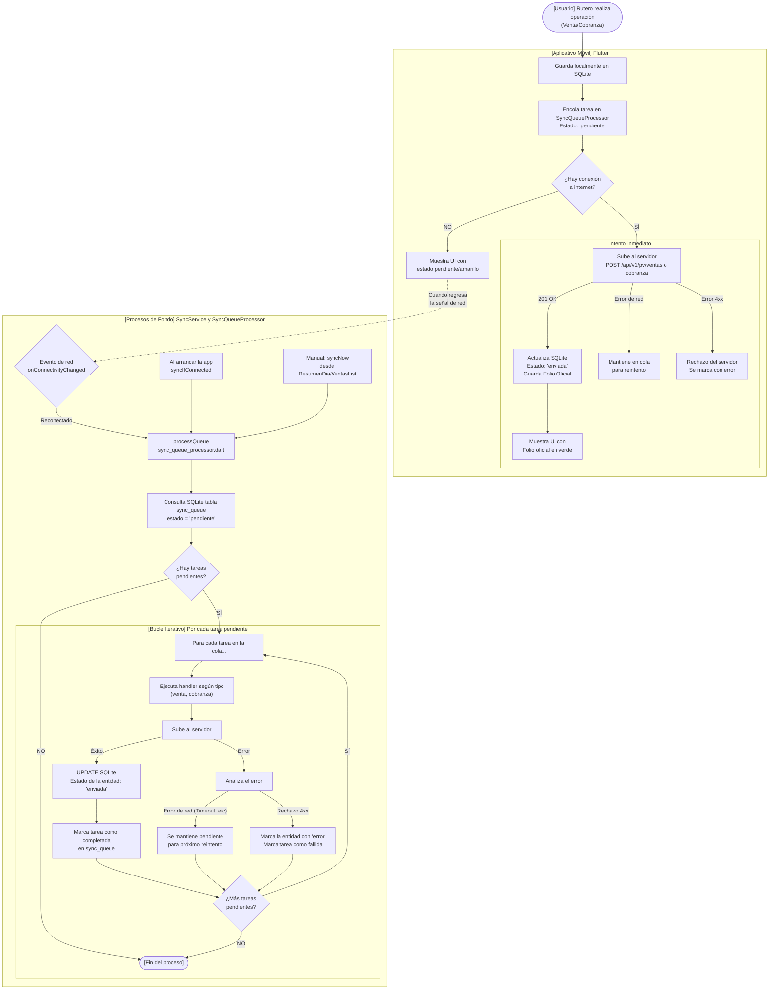

# RUTX Móvil

Aplicación **Flutter (Android)** de la plataforma de venta en ruta **RUTX**. Es el
**terminal del vendedor**: funciona **offline-first**, guarda cada operación localmente
en SQLite y la sincroniza con el backend cuando hay conexión.

```
┌─────────────────┐   HTTPS/JSON    ┌───────────────────┐   Firebird (SQL)   ┌──────────────────┐
│  App Móvil RUTX │ ──────────────► │  Sincronizador    │ ─────────────────► │  Microsip ERP    │
│  (Flutter,      │  JWT Bearer     │  (.NET 10, :5047) │    DOCTOS_PV y      │  (Punto de Venta)│
│  offline-first) │                 │                   │    catálogos        │                  │
└─────────────────┘                 └───────────────────┘                     └──────────────────┘
```

Ambos proyectos van **de la mano**: la app no escribe nada directo en Microsip — todo
pasa por el **sincronizador** (`sincronizador_rutx`), que es la única vía de escritura
hacia la BD del ERP.

---

## ✨ ¿Qué hace?

- 🔐 **Login con credenciales nativas de Firebird** (usuario del ERP resuelto contra
  `VENDEDORES`/`CAJEROS`) — sin usuarios de la app.
- 📥 **Descarga del día (sync matutino)**: clientes de la ruta, productos con existencias,
  precios (con impuestos compuestos), formas de cobro, emisor fiscal y sucursal.
- 📦 **Inventario del coche**: cada producto muestra las existencias de su almacén (ej.
  `RUTXALMACEN01`) y la venta no permite excederlas, incluso sin conexión.
- 🧾 **Ventas** con folio oficial consecutivo, impuestos compuestos (IVA + IEPS), validación
  de **límite de crédito** y auto-aplicación (`APLICADO='S'`).
- 🚫 **No-ventas** con causa, comentario y foto (persistida en documentos de la
  app y subida al servidor como multipart).
- 💳 **Cobranza** de ventas a crédito (abonos contra CxC) y consulta de **créditos**
  pendientes con días de atraso.
- 👥 **Clientes**: catálogo de la ruta y alta de cliente nuevo.
- 📊 **Resumen y cierre de jornada**: contado vs crédito, efectividad, devoluciones,
  cobrado por forma de pago.
- 🔔 **Notificaciones** de la oficina.
- 🧾 **Ticket** con datos fiscales del emisor y dirección de la sucursal.
- 📴 **Todo funciona sin internet** y se sincroniza solo cuando vuelve la señal.

---

## 🏆 Lo que nos enorgullece: el modelo offline

El corazón de la app es un **sistema offline-first con cola de sincronización reactiva**:
cada venta/cobranza se guarda primero en SQLite y se encola; cuando hay red, se envía al
servidor y se guarda el **folio oficial**.

### Diagrama del flujo Offline → Online



### ¿Es un bucle?

**Sí, pero es un bucle reactivo y basado en colas, NO un timer/polling continuo.**

| Tipo | Cómo funciona |
|---|---|
| **Bucle interno** (`processQueue`) | Itera sobre todas las tareas de la tabla `sync_queue` con estado `'pendiente'` y las procesa una por una, ejecutando el handler según su tipo (venta, cobranza). |
| **Bucle externo** (`SyncService`) | NO es un timer que revisa cada N segundos. Es una **suscripción a eventos de red** (`onConnectivityChanged`). Solo se activa cuando el SO notifica un cambio de conectividad (por ejemplo, al volver el WiFi/Datos). |

### Los 3 puntos donde se dispara la sincronización (`processQueue`)

| # | Dónde | Cuándo |
|---|---|---|
| 1 | `SyncService.start()` → `_syncIfConnected()` | Al **arrancar la app** (`main.dart`) |
| 2 | `SyncService._subscription` | Al **detectar reconexión** de red (evento del SO) |
| 3 | `ResumenDiaPage` / `VentasListPage` | Cuando el **usuario fuerza la sincronización** manualmente |

### Estados en SQLite

Dos niveles de estado: el del registro de negocio (ej. Venta) y el de la cola de sync.

**Entidad (ej. `ventas_pendientes`)**
- `pendiente` — guardada localmente, aún no enviada.
- `enviada` — sincronizada con éxito, ya tiene folio oficial.
- `error` — falló permanentemente (ej. el servidor devolvió un 400).

> [!NOTE] Compromiso de existencias
> Al confirmar la venta, el stock local del almacén se descuenta en la misma transacción
> que guarda la venta (`insertDescontandoExistencia`):
> - `pendiente` / `enviada` → descuentan existencias (las unidades ya no están disponibles).
> - `error` → el stock se **revierte** (el servidor rechazó la venta; las unidades nunca
>   salieron del almacén). Si la venta `error` se reenvía con éxito, se vuelve a descontar.

**Cola de sincronización (`sync_queue`)**
- `pendiente` — esperando ser procesada.
- `completada` — tarea finalizada con éxito.
- `error` — tarea finalizada con un error permanente.

### Existencia del almacén (el coche del vendedor)

El sincronizador envía `productos[].existencias` calculado para el almacén del vendedor
(ej. `RUTXALMACEN01`). La app:

1. **Muestra** la existencia en el catálogo y en la lista de productos de la venta
   (badge `Existencia: N` — rojo agotado, naranja bajo, verde suficiente).
2. **Valida** al agregar al carrito y al confirmar la venta: no se puede vender más de lo
   que hay en el almacén.
3. **Descuenta** el stock local en la misma transacción que guarda la venta
   (`insertDescontandoExistencia`), incluso sin conexión. Si algún artículo no alcanza,
   hay rollback y la venta no se guarda.
4. **Reviene** el stock si el servidor rechaza la venta de forma definitiva (estado
   `error`) y lo vuelve a descontar si esa venta se reenvía con éxito.
5. **Re-aplica** los descuentos de las ventas `pendiente` tras una re-descarga
   (`reaplicarExistenciasPendientes`), para que el stock local no "regrese" y permita
   sobreventa offline.

> [!IMPORTANT]
> **Gestión de errores y reintentos:**
> - Error de conectividad **transitorio** (Timeout, Connection Refused, SocketException) →
>   la tarea **no** se marca como error; se mantiene `pendiente` y se reintenta en el
>   próximo ciclo (cuando vuelva internet o al reiniciar la app).
> - Error del servidor tipo **4xx** (datos inválidos, venta duplicada rechazada) → ya no
>   se reintenta; se marca como `error` para evitar bucles infinitos que saturen la red.

---

## 🧱 Stack

- **Framework:** Flutter 3.x / Dart 3.7+
- **Plataforma:** Android (gama baja) + Linux (desarrollo)
- **Almacenamiento local:** SQLite (`sqflite`) — DAOs y entidades propias
- **Red:** `dio` + `connectivity_plus` (detección de red y reintentos)
- **Estado/sesión:** `shared_preferences` + `local_storage`
- **Extras:** `image_picker` (foto de no-ventas), `flutter_svg`, `intl`, `uuid`

---

## 🗂️ Estructura del proyecto

```
lib/
├── main.dart                       # Punto de entrada + arranque de SyncService
├── app/app.dart                    # MaterialApp y configuración
├── core/
│   ├── constants/                  # ApiConstants (IPs + puerto 5047), app_constants
│   ├── database/                   # app_database (SQLite) + daos/ + entities/
│   │   └── daos/                   # venta, cobranza, cliente, producto, cola_sincronizacion,
│   │                               #   folio_local, notificacion, emisor, sucursal, causa_no_venta
│   ├── network/                    # dio_client, connection_state_service, sync_service,
│   │                               #   sync_queue_processor, notification_polling_service
│   ├── storage/                    # local_storage (sesión y banderas)
│   ├── theme/                      # Tema visual de la app
│   └── errors/                     # Manejo de errores
├── features/
│   ├── auth/                       # Splash + Login (Firebird nativo)
│   ├── sync/                       # Descarga del día (download_page) + re-descarga
│   ├── catalog/                    # Catálogo de productos y clientes de la ruta
│   ├── sales/                      # Nueva venta, no-venta, detalle, lista, ticket
│   ├── cobranza/                   # Cobranza de ventas a crédito
│   ├── credito/                    # Consulta de créditos y documentos pendientes
│   ├── summary/                    # Resumen del día + cierre de jornada
│   ├── notifications/              # Notificaciones de oficina
│   └── home/                       # Pantalla principal
└── shared/
    └── widgets/                    # sale_card, ticket_card, connection_indicator,
                                    #   feedback_utils, rutx_app_bar, etc.
```

---

## 🔌 Configuración de conexión

En `lib/core/constants/api_constants.dart`:

- **Puerto:** 5047 (sincronizador).
- **URLs:** red local (LAN) y **Tailscale** (VPN, cualquier red). La app memoriza la
  primera que responda.
- El **health check** (`/health`) del sincronizador se usa para detectar disponibilidad.

---

## 🧪 Tests

```bash
flutter test
```
Cubre DAOs de SQLite, entidades (producto, venta pendiente), repositorio de sync
(incluido el reintento de la cola), el flujo de existencias del almacén (descuento
atómico, reversión por rechazo y re-aplicación tras re-sync) y smoke test de la app.

---

## 🔗 Relación con el sincronizador

Este repo consume la API de **`sincronizador_rutx`** (`.NET 10`), que es quien escribe
en la BD de Microsip. Para auditar que una BD de Microsip sea compatible con el flujo,
usa la carpeta `Integracion/` del repo del sincronizador
(`PROMPT_AUDITORIA.md` + `auditar_compatibilidad.py`).

---

## Licencia
Propietario — Teknologix / RUTX
